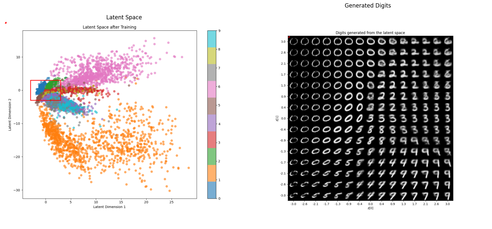

# Variational Autoencoders (VAE) Demonstration

This repo contains two scripts demonstrating Variational Autoencoder (VAE) implementations using different datasets and frameworks. The goal? To build an intuitive, working understanding of VAEs, explore how data can be compressed into latent space, and see how that space can be used to generate new, realistic data.

This is a foundational step in learning how generative AI models reason, compress, and create—because before diffusion models and LLMs, there was the good ol’ VAE: stable, elegant, and full of insight.

## Repository Structure

```
variational-autoencoder/
│
├── vae-mnist-demo/
│   ├── vae_mnist_demo.py
│   └── outputs/
│       ├── latent_space_epoch_{epoch}.png
│       ├── final_latent_space.png
│       └── generated_digits.png
│
├── basic-vae-demo/
│   ├── basic_vae_demo.py
│   └── outputs/
│       └── vae_training.gif
│
└── README.md
```

## Scripts Overview

### 1. `vae_mnist_demo.py`

- **Framework**: TensorFlow
- **Dataset**: MNIST
- **Description**: This script implements a VAE to learn the latent space representation of the MNIST dataset. It visualizes the latent space evolution and generates new digit images from the learned latent space.
- **Outputs**: 
  - Latent space visualizations saved as PNG files.
  - Generated digit images saved as PNG files.

#### Combined Visualization

The following image illustrates the relationship between the latent space and the generated digits. The red box in the latent space plot corresponds to the area used for generating the digits shown on the right.



### 2. `basic_vae_demo.py`

- **Framework**: PyTorch
- **Dataset**: 2D Moons
- **Description**: This script implements a VAE to learn the latent space representation of a 2D dataset generated using the `make_moons` function. It creates an animated GIF showing the training process and the evolution of the latent space.
- **Outputs**: 
  - An animated GIF of the training process saved in the `outputs` directory.
    

## Installation

To run these scripts, you need to have Python installed along with the following packages:

- TensorFlow
- PyTorch
- Matplotlib
- Scikit-learn

You can install the required packages using pip:

```bash
pip install tensorflow torch matplotlib scikit-learn
```

## Usage

### Running `vae_mnist_demo.py`

Navigate to the `vae-mnist-demo` directory and run the script:

```bash
cd vae-mnist-demo
python3 vae-mnist-demo.py
```

The script will generate and save visualizations of the latent space and generated digits in the `outputs` directory.

### Running `basic_vae_demo.py`

Navigate to the `basic-vae-demo` directory and run the script:

```bash
cd basic-vae-demo
python3 basic-vae-demo.py
```

The script will create and save an animated GIF of the training process in the `outputs` directory.

## Results

- **MNIST Tensorflow VAE**: Visualizes the latent space of the MNIST dataset and generates new digit images.
- **2D Moons PyTorch VAE**: Animates the training process of a VAE on a 2D dataset, showing the evolution of the latent space, and its attempt at reconstruction.

## Conclusion

This repository demonstrates a basic understanding of VAEs and their application in data generation using both TensorFlow and PyTorch. The scripts provide a foundation for further exploration and experimentation with VAEs and generative AI. 
